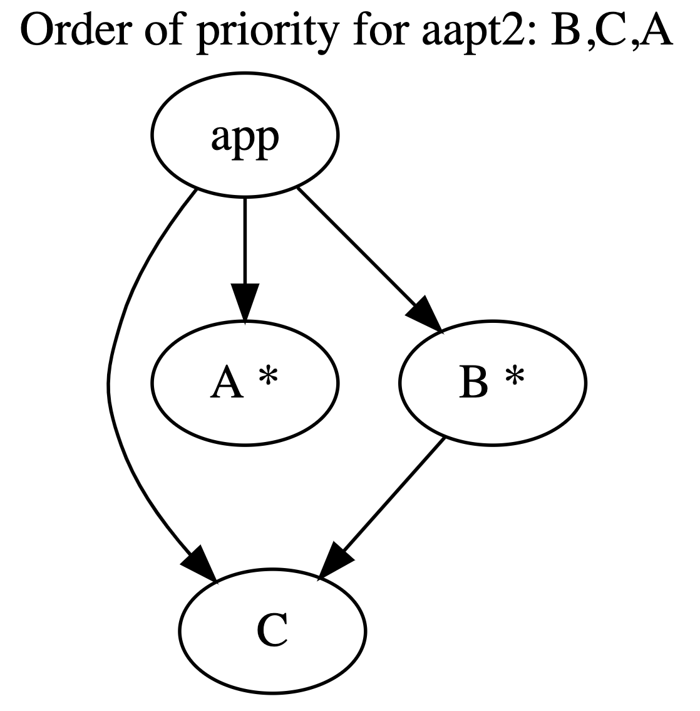

# Dependency Resources Linearization

 Demonstrate that the linearization of the dependency graph that gives to the order of priority to aapt2 when merging resources is hard to grasp for humans and that we can quickly have problems when scaling the number of modules.
 
 # Example
 
 In this example, we create an app with 3 module dependencies: 


The modules with a star: `A` and `B` contain the same resources (a string), with different values.
When the graph of dependency is defined in this order (the order of dependency in the build file is reflected in the tree below).:
```
app
  + -- A *
  + -- B *
    + -- C
```

Then, the order of the linerized path list passed to aapt2 is : `A,B,C`.

*Note: you can type the command `./gradlew :app:help | grep module` to print the path used by aapt2. Use `./gradlew clean :app:installDebug` to install.*

 # What is wrong?
 If we take the same example and add an edge: `app -> C`:
 


With the order of dependencies being modified to
```
app
  + -- C
  + -- A *
  + -- B *
    + -- C
```

Then, the order of the linerized path list passed to aapt2 becomes : `B,C,A`.

*Note: you can type the command `./gradlew :app:help | grep module` to print the path used by aapt2. Use `./gradlew clean :app:installDebug` to install.*

It is surprising, but as the `app` module introduces a new dependecy to `C` (i.e. a new edge between 2 modules that do not contribute conflictig resources): it
actually changes the order in which the conflict of resources is solved by aapt2 !

Indeed, when a new edge is created to `C`, all the branch of the tree from the app to C moves in the priority list and moves in front of `A`.

The problem is that this order / the impact on resources merging is very hard to comprehend for devs. Yes, it is predictible and reproducible (this is not a bug related to the linearization algorithm that comes from gradle). But, it is amazingly difficult for devs to foresee the consequences of their changes. 

The linearization algorithm is hard. Quickly as a dependency graph grows and includes hundreds / thousands of modules, this situation is becoming unmanageable and creates a fragile build. There are some cases where it becomes even almost impossible to tell where the change in the resource merging occured and how to modify it.


